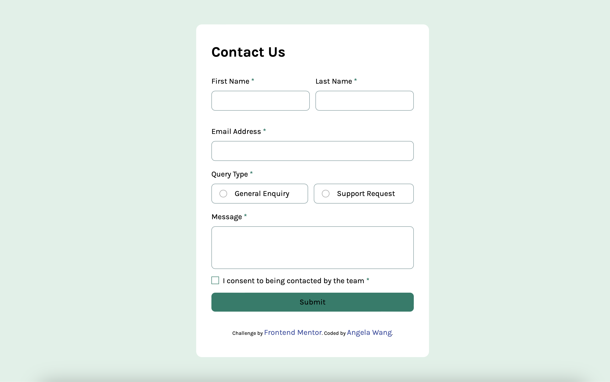

# Frontend Mentor - Contact form solution

This is a solution to the [Contact form challenge on Frontend Mentor](https://www.frontendmentor.io/challenges/contact-form--G-hYlqKJj). Frontend Mentor challenges help you improve your coding skills by building realistic projects.

## Table of contents

- [Overview](#overview)
  - [The challenge](#the-challenge)
  - [Screenshot](#screenshot)
  - [Links](#links)
- [My process](#my-process)
  - [Built with](#built-with)
  - [What I learned](#what-i-learned)
  - [Continued development](#continued-development)
  - [Useful resources](#useful-resources)
- [Author](#author)

## Overview
This is my first challenge on the Frontend Mentor platform. I hope to use this common form exercise to improve my layout skills and learn a new CSS framework (Tailwind CSS). This challenge covers the full range of typical user experiences, from form entry to submission.

### The challenge

Users should be able to:

- Complete the form and see a success toast message upon successful submission
- Receive form validation messages if:
  - A required field has been missed
  - The email address is not formatted correctly
- Complete the form only using their keyboard
- Have inputs, error messages, and the success message announced on their screen reader
- View the optimal layout for the interface depending on their device's screen size
- See hover and focus states for all interactive elements on the page

### Screenshot

### Links

- Solution URL: [Not uploaded yet](Not uploaded yet)
- Live Site URL: [https://yiiyeawang.github.io/contact-form-main/](https://yiiyeawang.github.io/contact-form-main/)

## My process

### Built with

- Semantic HTML5 markup
- CSS custom properties
- Flexbox
- CSS Grid
- Mobile-first workflow
- [React](https://reactjs.org/) - JS library
- [TailWind](https://tailwindcss.com) - For styles

### What I learned

This project aims to learn and understand the use of Tailwind CSS, focusing on flexible design and custom design, while addressing various issues that arise, such as:

- How to use Tailwind in a project.
- Understanding basic CSS styles in Tailwind.
- Using Tailwind to solve responsive web design (RWD) issues.
- Using Tailwind to enhance JavaScript interaction experiences.

### Continued development
Increase form response time control, applying it to forms and real projects.

### Useful resources

- [Tailwind CSS official website](https://tailwindcss.com) - This helped me for 「Set up the Tailwind CSS package.」、「Customize styles with Tailwind CSS.」reason. I really liked this pattern and will use it going forward.
- [Kelly CHI -Tailwind CSS 新手上路：概念、安裝與工具推薦](https://medium.com/@Kelly_CHI/tailwind-css-introduction-and-tools-68e770b2bf7f#773a) - This is an amazing article which helped me understand the overall way of using the package.. I'd recommend it to anyone still learning this concept.

## Author

- Website - [Angela Wang](https://yiiyeawang.github.io/My-website/)
- Frontend Mentor - [@Not uploaded yet](Not uploaded yet)

